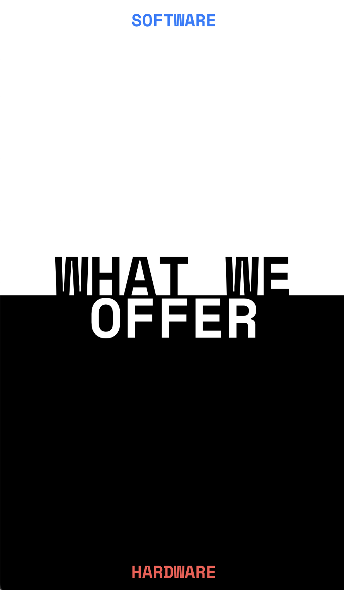
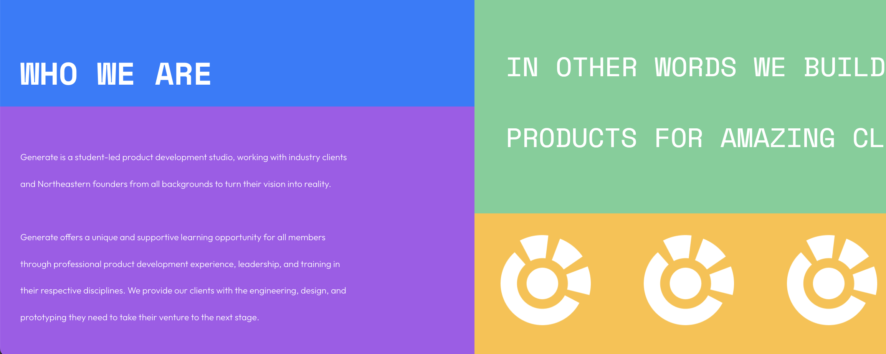
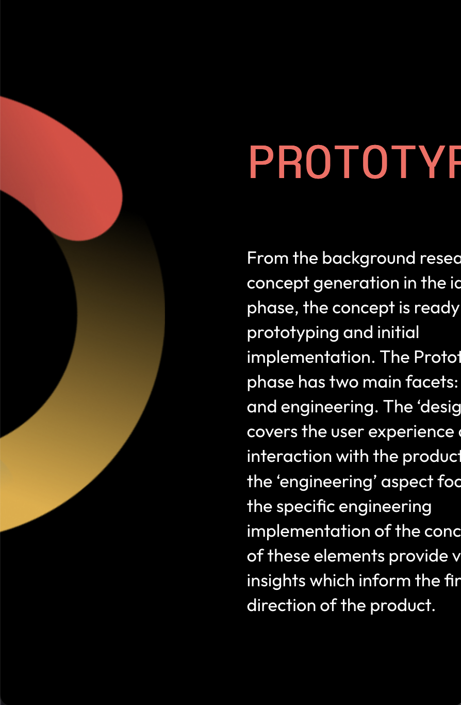

# What was the ticket?
 WT-2 - I worked on element resizing on the Landing page to ensure that elements remain visible and do not bleed into each other.
 Link to Ticket: https://generatenu.atlassian.net/jira/software/projects/WT/boards/2?selectedIssue=WT-2
​
 
 # What did I do?
 
I changed the CSS units for width, height, line-height, font-size, and other attributes to make them fit better on the page.
In some cases, I utilized CSS functions such as min() to ensure that a sizing which looked good at normal resolutions did not cause issues at extreme window sizes and shapes. I created rotated copies of the Product Development wheel instead of rotating a single image, and split the Ideation, Prototype, and Production components into two main elements enclosed by JSX fragments. 
 
 # How did I test it?
 
Describe in detail steps you used to test the changes you have made.
I viewed the window on a monitor to check for large viewport width and heights, shrank viewport width to its minimum while testing different viewport heights to test for extreme width-height ratios, and zoomed the page up to 500% to ensure that spacing remained consistent at high magnification.
​
 # What could go wrong in the future? What parts of your code should the reviewer pay the most attention to?
 
This PR only covers the landing page up to and including the Product Development Lifecycle section. Additionally, fixes to the nav bar may need to be aligned with what is currently on the main branch, and the repositioning of text in the Introduction element may break proper positioning of the scroll box in the bottom right corner.
  # Additional comments for the reviewers
 
For some reason, the branch does not currently contain a PRImages folder, so I had to include it in a new commit.
 # Screenshots

 MY VERSION

